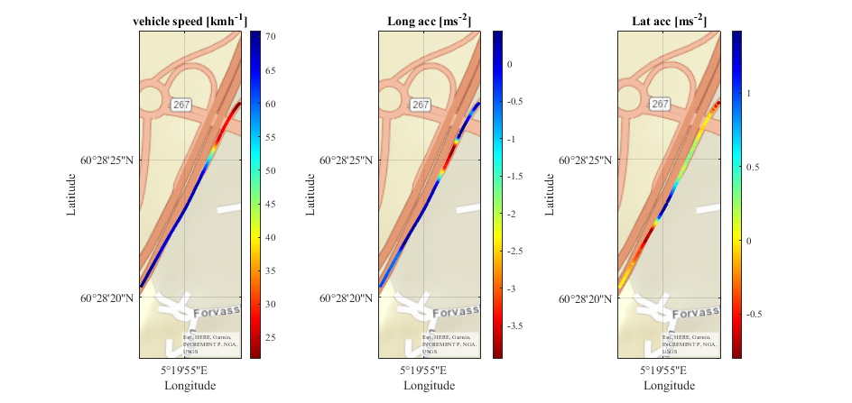
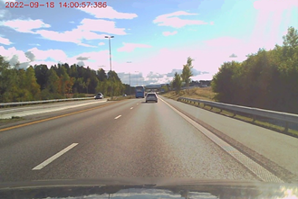
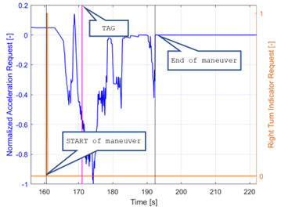

# Autonomous Off-ramp Maneuvers Dataset


This repository contains the dataset and a description of the data used in [Estimation of passenger comfort level for autonomous highway off-ramp maneuvers](https://link.to.paper).
This experimental dataset is composed of off-ramp exit maneuvers traveled along the Norwegian highways. Data are gathered on a [NIO](https://www.nio.com/) Battery Electric Vehicle (BEV) featured with L2+ driving automation functions. This study is conducted in a real-world environment, with the use of specific testing equipment. Data are acquired in the surroundings of Oslo, Bergen, Stavanger and Kristiansand.

This dataset is used for assessing the level of comfort associated with autonomous highway off-ramp maneuvers. As a consequence, each tested highway exit had to be carried out under **two different operating conditions** - **driving manually** for calibration purposes and **driving under vehicle autonomous control action**, called **AD-SW (AutonomousDriving-Software)** mode. 

  
Example of logged vehicle speed, longitudinal and lateral acceleration along the highway off-ramp exit Salhus/Flaktveit on E16.



Scene view camera output recorded during experimental tests.

## Dataset
Please follow this [link](https://www.cars.polito.it/) to download the dataset (~5MB).

## Dataset structure
The dataset has one folder, called **Maneuvers**, containing all the tested maneuvers, and a **Matlab script file** used to analyze the selected data (*Data_setup.m*). The **Maneuvers** folder contains 82 subdirectories called ***data_yearmonthdayTagxxxxxx***. Each folder contains the associated *.mat* file with the measured signals logged during experimental testing (***signals_yearmonthdayTagxxxxxx***).

```
Maneuvers
├── data_yearmonthdayTagxxxxxx
│   ├── signals_yearmonthdayTagxxxxxx
│   │   │── MeasList_LatA.. (Lateral acceleration signal [gs^{-2}]
│   │   │── MeasList_LgtA.. (Longitudinal acceleration signal [gs^{-2}]
│   │   │── MeasList_VehSpd.. (Vehicle speed signal [kmh^{-1}]
│   │   │── MeasList_GPS_Longitude.. (Longitude position signal [° ' '']
│   │   │── MeasList_GPS_Latitude.. (Latitude position signal [° ' '']
```

## Data description
Please check our paper for a detailed data description. 

### Signals recording
Given the extended duration of each test, it becomes imperative to employ a methodology for extracting pertinent timestamps from the data. In our particular study, a tagging approach was implemented to fulfill this requirement. Therefore, when the driver activates the vehicle's right turn indicator, the autonomous control system is triggered to initiate the self-driving off-ramp manoeuvre. This is when manoeuvre data logging commences. Actually, active steering towards the highway deceleration ramp is triggered by the right turn indicator. Rather, the manoeuvre data logging ends when the autonomous controller deceleration request drops to 0, at which point the driver regains complete control of the vehicle, and active guidance is turned off.




## Citation
If you find our work useful in your research, please consider citing:

    @ARTICLE{Tramacerecomfort,
  	    author={Tramacere, Eugenio and Castellonos, Luis and Luciani, Sara and Urgesi, Paolo and Amati, Nicola},
  	    journal={-}, 
  	    title={Estimation of passenger comfort level for autonomous highway off-ramp maneuvers}, 
  	    year={202x},
  	    volume={},
  	    number={},
  	    pages={-},
  	    doi={-}}
