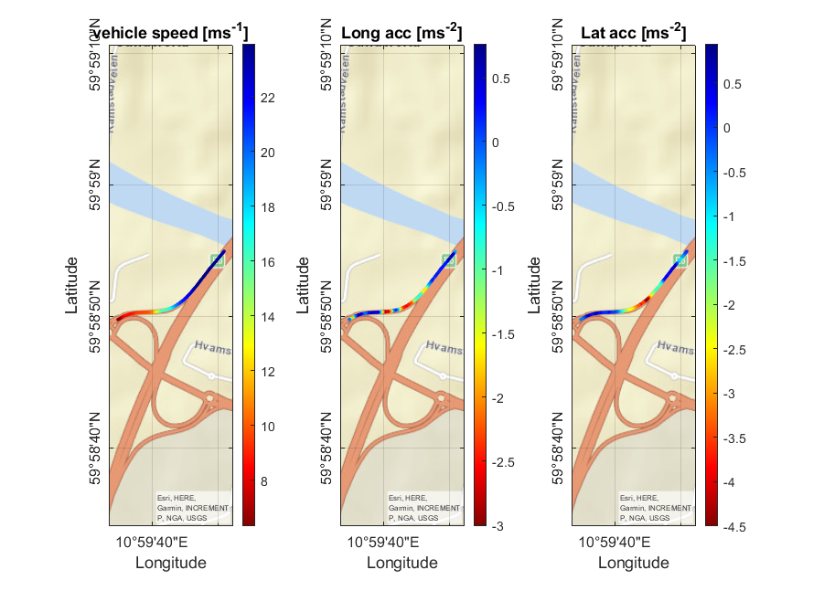

# Autonomous Off-ramp Maneuvers Dataset


This repository contains the dataset and a description of the data used in [Estimation of passenger comfort level for autonomous highway off-ramp maneuvers](https://link.to.paper).
This experimental dataset is composed of off-ramp exit maneuvers traveled along the Norwegian highways. Data are gathered on a [NIO](https://www.nio.com/) Battery Electric Vehicle (BEV) featured with L2+ driving automation functions. This study is conducted in a real-world environment, with the use of specific testing equipment. Data are acquired in the surroundings of Oslo, Bergen, Stavanger and Kristiansand.

This dataset is used for assessing the level of comfort associated with autonomous highway off-ramp maneuvers. As a consequence, each tested highway exit had to be carried out under **two different operating conditions** - **driving manually** for calibration purposes and **driving under vehicle autonomous control action**, called **AD-SW (AutonomousDriving-Software)** mode. 

  
Example of logged vehicle speed, longitudinal and lateral acceleration along the highway off-ramp exit Salhus/Flaktveit on E16.


Scene view camera output recorded during experimental tests.

## Dataset
Please follow this [link](https://www.cars.polito.it/) to download the dataset (~5MB).

## Dataset structure
The dataset has one folder, called **Maneuvers**, containing all the tested maneuvers, and a **Matlab script file** used to analyze the selected data (*Data_setup.m*). Each contains a subdirectory *data* and *ImageSets*. *data* contains 6,000 point clouds in the .pcd format and 6,000 labels with the corresponding index in the .txt format similar to the [KITTI label format](https://github.com/bostondiditeam/kitti/blob/master/resources/devkit_object/readme.txt). *ImageSet* contains three .txt files, train.txt, val.txt, and test.txt, listing the indices of the point clouds used for training, validation, and testing. Our split is 4000, 1000, 1000 for training, validation, and testing, respectively.  
```
Sim2RealDistributionAlignedDataset
├── real
│   ├── data
│   │   │── pcl
│   │   │   │── 000000.pcd
│   │   │   │── ...
│   │   │   │── 029995.pcd
│   │   │── label
│   │   │   │── 000000.txt
│   │   │   │── ...
│   │   │   │── 029995.txt
│   ├── ImageSets
│   │   │── train.txt
│   │   │── val.txt
│   │   │── test.txt
├── sim
│   ├── data
│   │   │── pcl
│   │   │   │── 000000.pcd
│   │   │   │── ...
│   │   │   │── 029995.pcd
│   │   │── label
│   │   │   │── 000000.txt
│   │   │   │── ...
│   │   │   │── 029995.txt
│   ├── ImageSets
│   │   │── train.txt
│   │   │── val.txt
│   │   │── test.txt

```

## Data description
Please check our paper for a detailed data description. 

### Real dataset
The real dataset was captured during  the [Indy Autonomous Challenge](https://www.indyautonomouschallenge.com/) in Las Vegas in 2022. The vehicle used for data generation was an autonomous AV-21 equipped with three LiDAR sensors, each covering 120° horizontally to cover 360° in total. The .pcd files include the fused point clouds. Labeling was done semi-automatically using the GPS positions of the ego-vehicle and the other vehicles on track. The positions were refined using the point cloud distribution in the proximity of the initially placed 3D bounding boxes. 

### Sim dataset
The sim dataset is distribution-aligned, i.e., scenario-identical, with the real dataset. It was created using Unity and a custom LiDAR sensor model. The environment models the same racetrack as in the real data. The scenarios extracted from the real dataset were replayed in this simulation environment and point clouds were captured using the custom LiDAR sensor model. The labels were generated automatically in Unity.  


Real (left) and sim (right) AV21 used for dataset generation


## Citation
If you find our work useful in your research, please consider citing:

    @ARTICLE{Tramacerecomfort,
  	    author={Tramacere, Eugenio and Castellonos, Luis and Luciani, Sara and Urgesi, Paolo and Amati, Nicola},
  	    journal={-}, 
  	    title={Estimation of passenger comfort level for autonomous highway off-ramp maneuvers}, 
  	    year={202x},
  	    volume={},
  	    number={},
  	    pages={-},
  	    doi={-}}
